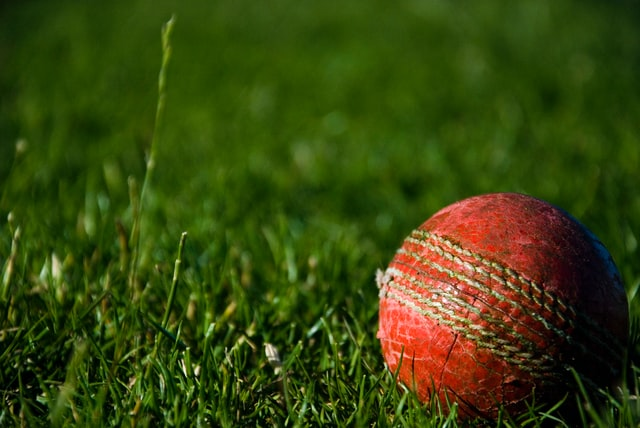

# Cricket-EDA

<!-- PROJECT SHIELDS -->
[![Contributors][contributors-shield]][contributors-url]

<!-- TABLE OF CONTENTS -->
## Table of Contents
  - [About the Project](#about-the-project)
    - [Overview](#overview)
  - [Built With](#built-with)
    - [Data Source](#data-source)
    - [Plan](#plan)
  - [Approach](#approach)
    - [Data Cleaning](#data-cleaning)
    - [Data Preprocessing](#data-preprocessing)
  - [Results](#results)
  - [Contributing](#contributing)
  - [References](#references)
  - [Acknowledgements](#acknowledgements)

## About the Project 

Photo by <a href="https://unsplash.com/@theinfluencermarketingfactory?utm_source=unsplash&amp;utm_medium=referral&amp;utm_content=creditCopyText">Alessandro Bogliari</a> on <a href="https://unsplash.com/s/photos/cricket?utm_source=unsplash&amp;utm_medium=referral&amp;utm_content=creditCopyText">Unsplash</a>

### Overview

## Built With

* [Python](https://www.python.org/)
* [Jupyter Notebook](https://jupyter.org/)
* [Google Colab](https://colab.research.google.com/)

### Problem Statement

### Data Source

### Plan

## Approach

### Data Cleaning

### Data Preprocessing 

## Results

<!-- CONTRIBUTING -->
## Contributing  

Any contributions you make are **greatly appreciated**.

1. Fork the Project
2. Create your Feature Branch (`git checkout -b feature/amazing-feature`)
3. Commit your Changes (`git commit -m 'feat: some amazing feature'`)
4. Push to the Branch (`git push origin feature/amazing-feature`)
5. Open a Pull Request

## References

<!-- ACKNOWLEDGEMENTS -->
## Acknowledgements
* [Img Shields](https://shields.io)
* [Iconify](https://iconify.design/)
* [Unsplash](https://unsplash.com/)
* [Badgen](https://badgen.net/)
* [For The Badge](https://forthebadge.com/)

<!-- MARKDOWN LINKS -->
<!-- https://www.markdownguide.org/basic-syntax/#reference-style-links -->
[contributors-shield]: https://img.shields.io/github/contributors/MaharshSuryawala/Cricket-EDA?style=flat-square 
[contributors-url]: https://github.com/MaharshSuryawala/Cricket-EDA/graphs/contributors
